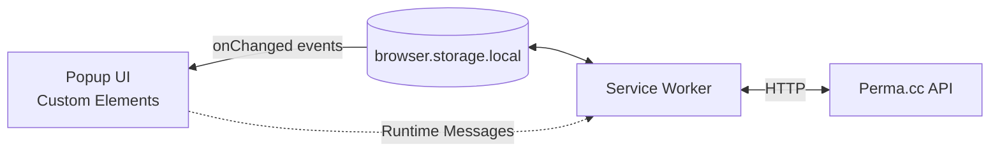

# perma-extension
A browser extension for [Perma.cc](https://perma.cc/). Create and manage Perma links directly from the browser.

- **Current version:** 2.0.1
- **Browsers currently supported:** Google Chrome (100+)

[](https://github.com/harvard-lil/perma-extension/actions/workflows/playwright.yml)

📹 [How does it work ?](https://www.youtube.com/watch?v=zVz1SAtdw8A)

💾 [Download it on the Chrome Web Store](https://chrome.google.com/webstore/detail/permacc/bigjakhahgnccheaompmgebkncglllel)

---

## Summary
- [Architecture](#architecture)
- [Development Setup](#development-setup)
- [Environment variables](#environment-variables)
- [API Documentation](#api-documentation)
- [CLI](#cli)
- [Building and distributing the extension](#building-and-distributing-the-extension)
- [Automation](#automation)

---

## Architecture



- This projects uses [`browser.storage.local`](https://developer.mozilla.org/en-US/docs/Mozilla/Add-ons/WebExtensions/API/storage/local) - made available by the Web Extensions API - to persist data and monitor changes. 
- By design, only [the Service Worker](/src/background/index.js) interacts directly with storage, using [data classes](/src/storage/) to normalize the nature of the data being stored and retrieved. 
- The [front-end](/src/popup/) sends [runtime messages](https://developer.mozilla.org/en-US/docs/Mozilla/Add-ons/WebExtensions/API/runtime/sendMessage) to the service worker, which reacts accordingly. _(See: [list of available message ids](/docs/constants/index.md#module_constants.MESSAGE_IDS).)_
- The front-end is made of [_"bare"_ Custom Elements](https://javascript.info/custom-elements), taking data as HTML attributes, which they observe and react to. 
- [`handlers/onStorageUpdate`](/src/popup/handlers/onStorageUpdate.js) is executed every time storage is updated. It determines what was updated, and what part of the UI needs to be re-hydrated.

[☝️ Back to summary](#summary)

---

## Development Setup

### Getting started
- Make sure you have [the latest version of Node JS](https://nodejs.org/en/) installed on your machine _(18+ recommended)_.
- Run `npm install` to install dependencies.
- Use `npm run dev` to start _"development"_ mode. This effectively starts `vite build --watch`, creating a new build under `/dist` every time a file changes.

### Google Chrome: Install the work-in-progress extension
- Open a new tab to `chrome://extensions`
- Make sure to activate the _"Developer Mode"_ toggle.
- Click on _"Load unpacked"_ and select the `dist` folder in `perma-extension`.

### Misc
- This project uses `/*html*/` to indicate that a JavaScript template string contains HTML. For VSCode users, we recommend [the `es6-string-html` extension to enable syntax highlighting in that context](https://marketplace.visualstudio.com/items?itemName=Tobermory.es6-string-html).

[☝️ Back to summary](#summary)

---

## Environment Variables

### Scope: E2E testing
The following environment variables are only used in the context of [the test suites](#testing).
They may be provided using an `.env` file, which the Playwright test runner will take into account. 

| Name | Context | Required | Description |
| --- | --- | --- | --- |
| `TESTS_API_KEY` | Test suite | Yes | API key to be used for E2E tests. |
| `CI` | Test suite | No | Will alter test reporting if set _(see `playwright.config.js`)_. Used to run tests in a GitHub Action. | 

[☝️ Back to summary](#summary)

---

## API Documentation

Automatically-generated API documentation. Uses [JSDoc](https://jsdoc.app/) comments.

### background
- [index.js _(Entry point)_](/doc/background/index.md)
- [archiveCreate.js](/doc/background/archiveCreate.md)
- [archiveDelete.js](/doc/background/archiveDelete.md)
- [archivePullTimeline.js](/doc/background/archivePullTimeline.md)
- [archiveTogglePrivacyStatus.js](/doc/background/archiveTogglePrivacyStatus.md)
- [authCheck.js](/doc/background/authCheck.md)
- [authSignIn.js](/doc/background/authSignIn.md)
- [authSignOut.js](/doc/background/authSignOut.md)
- [foldersPick.js](/doc/background/foldersPick.md)
- [foldersPullList.js](/doc/background/foldersPullList.md)
- [statusCleanUp.js](/doc/background/statusCleanUp.md)
- [tabSwitch.js](/doc/background/tabSwitch.md)

### constants
- [index.js _(Entry point)_](/doc/constants/index.md)

### popup
- [index.js _(Entry point)_](/doc/popup/index.md)
- **popup/components**
  - [AppHeader.js](/doc/popup/components/AppHeader.md)
  - [ArchiveForm.js](/doc/popup/components/ArchiveForm.md)
  - [ArchiveTimeline.js](/doc/popup/components/ArchiveTimeline.md)
  - [StatusBar.js](/doc/popup/components/StatusBar.md)
- **popup/handlers**
  - [onPopupOpen.js](/doc/popup/handlers/onPopupOpen.md)
  - [onStorageUpdate.js](/doc/popup/handlers/onStorageUpdate.md)

### storage
- [index.js _(Entry point)_](/doc/storage/index.md)
- [Archives.js](/doc/storage/Archives.md)
- [Auth.js](/doc/storage/Auth.md)
- [CurrentTab.js](/doc/storage/CurrentTab.md)
- [Folders.js](/doc/storage/Folders.md)
- [Status.js](/doc/storage/Status.md)

[☝️ Back to summary](#summary)

---

## CLI

### dev
```
npm run dev
```

Starts _"development"_ mode.  Effectively runs `vite build --watch`, creating a new build under `/dist` every time a file changes. 

### build 
```
npm run build
```

Generates a new extension build under `/dist`.

### build-and-zip
```
npm run build-and-zip
```

Generates a new extension build under `/dist` and generates a zip from it _(`perma-extension.zip`)_.

### docgen
```bash
npm run docgen
```

Generates documentation using [`JSDoc` comments](https://jsdoc.app/). Outputs as Markdown to `doc`.
To update which files should be taken into account, check `/scripts/docgen.sh`.

### test
```bash
npm run test
```

Runs the end-to-end tests suite using [playwright](https://playwright.dev/).

[☝️ Back to summary](#summary)

---

## Building and distributing the extension

**Step-by-step**:
- On `develop`:
  - Update documentation (`npm run docgen`)
  - Update APP version number in:
    - [`manifest.json`](https://github.com/harvard-lil/perma-extension/blob/develop/src/manifest.json#L5)
    - This README 
- Commit changes to `develop` and create a pull request from `develop` to `main`
  - Merge to `main` when tests pass
- On the `main` branch:
    - At GitHub Level: [Create a new release](https://github.com/harvard-lil/perma-extension/releases/new). 
      - Using the `main` branch
      - Using [semver](https://semver.org/) as a title and tag _(i.e: `2.0.1`)_
  - Locally: 
    - Run `npm run build-and-zip` to generate `perma-extension.zip`.
- On the [Chrome Web Store](https://chrome.google.com/webstore/category/extensions)
  - Upload `perma-extension.zip`

[☝️ Back to summary](#summary)

---

## Automation

The [E2E test suite is run via GitHub Action on](/.github/workflows/tests.yml):
- Pull request to `develop`, `main`
- Push to `main`

[☝️ Back to summary](#summary)
