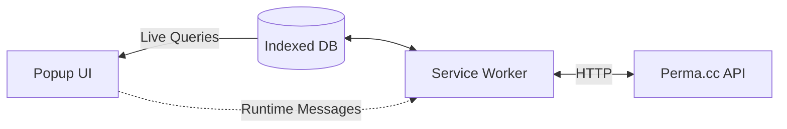

# perma-extension
(Prototype) A browser extension for Perma.cc

🚧 Work in progress.

---

## Summary
- [Architecture](#architecture)
- [Development Setup](#development-setup)

---

## Architecture

[☝️ Back to summary](#summary)

---

## Development Setup

### Getting started
- Make sure you have [the latest version of Node JS LTS](https://nodejs.org/en/) installed on your machine.
- Run `npm install` to install runtime and dev dependencies.
- Use `npm run dev` to start _"development"_ mode. 
  - Since this is a browser extension, the idea here is to make new builds under `/dist` every time a file changes.

### Adding the work-in-progress extension to Google Chrome
- Open a new tab to `chrome://extensions`
- Make sure to activate the _"Developer Mode"_ toggle.
- Click on _"Load unpacked"_ and navigate down to `perma-extension/dist`