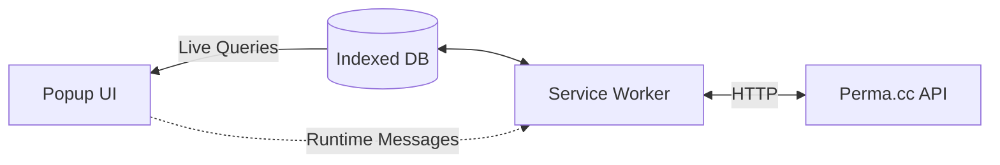

# perma-extension
(Prototype) A browser extension for Perma.cc

🚧 Work in progress.

---

## Summary
- [Architecture](#architecture)
- [Development Setup](#development-setup)

---

## Architecture

[☝️ Back to summary](#summary)
