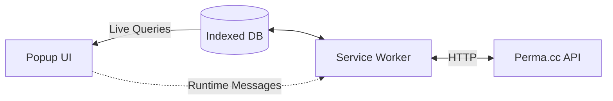

# perma-extension
(Prototype) A browser extension for Perma.cc

🚧 Work in progress.

---

## Summary
- [Architecture](#architecture)
- [Development Setup](#development-setup)
- [Environment variables](#environment-variables)

---

## Architecture

[☝️ Back to summary](#summary)

---

## Development Setup

### Getting started
- Make sure you have [the latest version of Node JS](https://nodejs.org/en/) installed on your machine. 
- Run `npm install` to install runtime and dev dependencies.
- Use `npm run dev` to start _"development"_ mode. This effectively starts `vite build --watch`, creating a new build under `/dist` every time a file changes.

### Adding the work-in-progress extension to Google Chrome
- Open a new tab to `chrome://extensions`
- Make sure to activate the _"Developer Mode"_ toggle.
- Click on _"Load unpacked"_ and select the `dist` folder under `perma-extension`.

[☝️ Back to summary](#summary)

---

## Environment Variables

> 🚧 TBD 

[☝️ Back to summary](#summary)