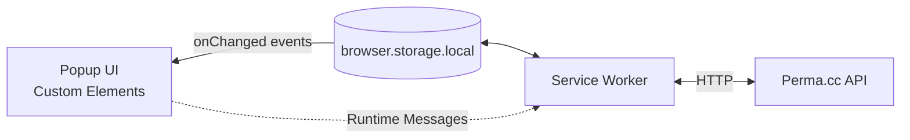

# perma-extension

A browser extension for [Perma.cc](https://perma.cc/). Create and manage Perma links directly from the browser.

- **Current version:** 2.0.5
- **Browsers currently supported:** Google Chrome (100+), Mozilla Firefox (112+)

[](https://github.com/harvard-lil/perma-extension/actions/workflows/playwright.yml)

📹 [How does it work?](https://www.youtube.com/watch?v=zVz1SAtdw8A)

💾 Download the extension:
- [Chrome Web Store](https://chrome.google.com/webstore/detail/permacc/bigjakhahgnccheaompmgebkncglllel)
- [Add-ons for Firefox](https://addons.mozilla.org/en-US/firefox/addon/perma-cc)

---

## Summary

- [Architecture](#architecture)
- [Development Setup](#development-setup)
- [Environment variables](#environment-variables)
- [API Documentation](#api-documentation)
- [CLI](#cli)
- [Building and distributing the extension](#building-and-distributing-the-extension)
- [Automation](#automation)

---

## Architecture


```mermaid
flowchart RL
    A[Service Worker]
    B[(browser.storage.local)]
    C[Popup UI<br>Custom Elements]
    D[Perma.cc API]
    A <--> B
    B --> |onChanged events| C
    C -.-> |Runtime Messages| A
    D <--> |HTTP| A
```

- This projects uses [`browser.storage.local`](https://developer.mozilla.org/en-US/docs/Mozilla/Add-ons/WebExtensions/API/storage/local) - made available by the Web Extensions API - to persist data and monitor changes.
- By design, only [the Service Worker](/src/background/index.js) interacts directly with storage, using [data classes](/src/storage/) to normalize the nature of the data being stored and retrieved.
- The [front-end](/src/popup/) sends [runtime messages](https://developer.mozilla.org/en-US/docs/Mozilla/Add-ons/WebExtensions/API/runtime/sendMessage) to the service worker, which reacts accordingly. _(See: [list of available message ids](/docs/constants/index.md#module_constants.MESSAGE_IDS).)_
- The front-end is made of [_"bare"_ Custom Elements](https://javascript.info/custom-elements), taking data as HTML attributes, which they observe and react to.
- [`handlers/onStorageUpdate`](/src/popup/handlers/onStorageUpdate.js) is executed every time storage is updated. It determines what was updated, and what part of the UI needs to be re-hydrated.

[☝️ Back to summary](#summary)

---

## Development Setup

### Getting started

- Make sure you have [the latest version of Node.js](https://nodejs.org/en/) installed on your machine _(Vite 8 requires Node 20.19+ or 22.12+; 22+ recommended)_, along with [`just`](https://github.com/casey/just) for running project tasks.
- Run `just setup` to install dependencies (npm packages + the Chromium build Playwright uses for tests).
- Use `just dev` to build the extension and launch it in a browser with the extension preloaded, auto-reloading on every source change. Use `just dev firefox` to do the same in Firefox.
  + If you only want a rebuild-on-change loop without launching a browser, use `just watch` (or `just watch firefox`).

### Install the work-in-progress extension

If you'd rather load the build into your own browser manually instead of using `just dev`:

#### Google Chrome

- Open a new tab to `chrome://extensions`.
- Make sure to activate the _"Developer Mode"_ toggle.
- Click on _"Load unpacked"_ and select the `dist` folder in `perma-extension`.

#### Mozilla Firefox

- Open a new tab to `about:debugging`.
- Click on _"This Firefox"_ in the navigation bar.
- Click on _"Load Temporary Add-on..."_ and select the `manifest.json` file in `perma-extension/dist`.

### Misc

- This project uses `/*html*/` to indicate that a JavaScript template string contains HTML. For VSCode users, we recommend [the `es6-string-html` extension to enable syntax highlighting in that context](https://marketplace.visualstudio.com/items?itemName=Tobermory.es6-string-html).

[☝️ Back to summary](#summary)

---

## Environment Variables

### Scope: E2E testing

The following environment variables are only used in the context of [the test suites](#testing). They may be provided using an `.env` file, which both `just` and the Playwright test runner load.

| Name | Context | Required | Description |
| --- | --- | --- | --- |
| `TESTS_API_KEY` | Test suite | Yes | API key to be used for E2E tests. Must belong to `perma-js-sdk-test-user` unless `TESTS_API_ALLOW_NON_TEST_USER=1` is set. |
| `TESTS_API_ALLOW_NON_TEST_USER` | Test suite | No | Set to `"1"` only when intentionally running live API tests with a non-test account. |
| `CI` | Test suite | No | Will alter test reporting if set _(see `playwright.config.js`)_. Used to run tests in a GitHub Action. |
| `HEADLESS` | Test suite | No | Defaults to headless (Chromium's new headless mode, which loads the extension). Set to `"false"` to watch the browser; with `just`, run `just headful=1 test`. |
| `FIREFOX_BIN` | Dev (`just dev firefox`) | No | Path to the Firefox binary web-ext should launch. Leave unset to use `firefox` on `PATH`; set it for a non-standard build like Firefox Developer Edition. |

### Scope: Building the extension

The following environment variable is only used in the context of [building the extension](#building-and-distributing-the-extension). It may also be provided using an `.env` file, which the Vite build process will take into account.

| Name | Context | Required | Description |
| --- | --- | --- | --- |
| `TARGET` | Build process | No | Target browser to use. Set to `"firefox"` if building for Mozilla Firefox; otherwise the build process will target Google Chrome. |

[☝️ Back to summary](#summary)

---

## API Documentation

Automatically-generated API documentation. Uses [JSDoc](https://jsdoc.app/) comments.

### background

- [index.js _(Entry point)_](/doc/background/index.md)
- [archiveCreate.js](/doc/background/archiveCreate.md)
- [archiveDelete.js](/doc/background/archiveDelete.md)
- [archivePullTimeline.js](/doc/background/archivePullTimeline.md)
- [archiveTogglePrivacyStatus.js](/doc/background/archiveTogglePrivacyStatus.md)
- [authCheck.js](/doc/background/authCheck.md)
- [authSignIn.js](/doc/background/authSignIn.md)
- [authSignOut.js](/doc/background/authSignOut.md)
- [foldersPick.js](/doc/background/foldersPick.md)
- [foldersPullList.js](/doc/background/foldersPullList.md)
- [statusCleanUp.js](/doc/background/statusCleanUp.md)
- [tabSwitch.js](/doc/background/tabSwitch.md)

### constants

- [index.js _(Entry point)_](/doc/constants/index.md)

### popup

- [index.js _(Entry point)_](/doc/popup/index.md)
- **popup/components**
  - [AppHeader.js](/doc/popup/components/AppHeader.md)
  - [ArchiveForm.js](/doc/popup/components/ArchiveForm.md)
  - [ArchiveTimeline.js](/doc/popup/components/ArchiveTimeline.md)
  - [StatusBar.js](/doc/popup/components/StatusBar.md)
- **popup/handlers**
  - [onPopupOpen.js](/doc/popup/handlers/onPopupOpen.md)
  - [onStorageUpdate.js](/doc/popup/handlers/onStorageUpdate.md)

### storage

- [index.js _(Entry point)_](/doc/storage/index.md)
- [Archives.js](/doc/storage/Archives.md)
- [Auth.js](/doc/storage/Auth.md)
- [CurrentTab.js](/doc/storage/CurrentTab.md)
- [Folders.js](/doc/storage/Folders.md)
- [Status.js](/doc/storage/Status.md)

[☝️ Back to summary](#summary)

---

## CLI

Project tasks are run with [`just`](https://github.com/casey/just). Run `just` (or `just --list`) to see every recipe. Browser-specific recipes take a `target` argument (`chrome` or `firefox`) that defaults to `chrome` — e.g. `just build` builds for Chrome, `just build firefox` for Firefox.

### setup

```bash
just setup
```

Installs dependencies: npm packages + the Chromium build used by the test suite.

### build

```bash
just build          # or: just build firefox
```

Generates a new extension build under `/dist` for the target browser.

### dev

```bash
just dev            # or: just dev firefox
```

Builds the target variant and launches it in a browser via web-ext, with the extension preloaded and auto-reloading on every source change. For Firefox, set `FIREFOX_BIN` in `.env` if you use a non-standard build (e.g. Developer Edition).

### watch

```bash
just watch          # or: just watch firefox
```

Rebuilds into `/dist` on every source change, without launching a browser.

### test

```bash
just test           # or: just headful=1 test  (to watch the browser)
```

Runs the end-to-end test suite using [Playwright](https://playwright.dev/). Headless by default; the scenario specs require a live `TESTS_API_KEY`.

### test-components

```bash
just test-components
```

Runs only the self-contained component tests (no API key required).

### lint

```bash
just lint           # or: just lint firefox
```

Lints the built extension with web-ext (validates the manifest, etc.).

### package

```bash
just package        # or: just package firefox
```

Builds the target variant and packages `/dist` into `perma-extension-<target>.zip` for distribution.

### docs

```bash
just docs
```

Generates documentation using [`JSDoc` comments](https://jsdoc.app/). Outputs as Markdown to `doc`. To update which files should be taken into account, check `/scripts/docgen.sh`.

### clean

```bash
just clean
```

Removes build output (`dist/` and any `perma-extension*.zip`).

[☝️ Back to summary](#summary)

---

## Building and distributing the extension

Note: to build for Mozilla Firefox, pass the `firefox` target to the `just` recipes below (e.g. `just package firefox`).

**Step-by-step**:
- On `develop`:
  - Update documentation (`just docs`)
  - Update version number in:
    - [`manifest.json`](https://github.com/harvard-lil/perma-extension/blob/develop/src/manifest.json#L5)
    - This README
- Commit changes to `develop` and create a pull request from `develop` to `main`
  - Merge to `main` when tests pass
- On the `main` branch:
    - At GitHub Level: [Create a new release](https://github.com/harvard-lil/perma-extension/releases/new).
      - Using the `main` branch
      - Using [semver](https://semver.org/) as a title and tag _(i.e: `2.0.1`)_
  - Locally:
    - Run `just package` to generate `perma-extension-chrome.zip` (or `just package firefox` for `perma-extension-firefox.zip`).
- On the [Chrome Web Store](https://chrome.google.com/webstore/category/extensions) or [Add-ons for Firefox](https://addons.mozilla.org/en-US/firefox/)
  - Upload the generated `.zip`

[☝️ Back to summary](#summary)

---

## Automation

The [E2E test suite is run via GitHub Action on](/.github/workflows/tests.yml):
- Pull request to `develop`, `main`
- Push to `main`

[☝️ Back to summary](#summary)
