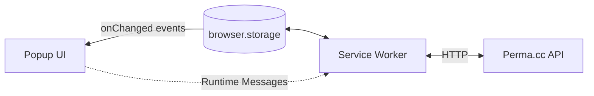

> 🚧 Work in progress.

# perma-extension
A browser extension for [Perma.cc](https://perma.cc/). Create and manage Perma links directly from the browser.

---

## Summary
- [Architecture](#architecture)
- [Tech Stack](#tech-stack)
- [Development Setup](#development-setup)
- [Environment variables](#environment-variables)
- [API Documentation](#api-documentation)
- [CLI](#cli)
- [Building and distributing the extension](#building-and-distributing-the-extension)

---

## Architecture

> 🚧 TODO

[☝️ Back to summary](#summary)

---

## Tech Stack

> 🚧 TODO

[☝️ Back to summary](#summary)

---

## Development Setup

> 🚧 TODO

### Getting started
- Make sure you have [the latest version of Node JS](https://nodejs.org/en/) installed on your machine. 
- Run `npm install` to install runtime and dev dependencies.
- Use `npm run dev` to start _"development"_ mode. This effectively starts `vite build --watch`, creating a new build under `/dist` every time a file changes.

### Adding the work-in-progress extension to Google Chrome
- Open a new tab to `chrome://extensions`
- Make sure to activate the _"Developer Mode"_ toggle.
- Click on _"Load unpacked"_ and select the `dist` folder under `perma-extension`.

### Known quirks 

> 🚧 TODO

[☝️ Back to summary](#summary)

---

## Environment Variables

> 🚧 TBD 

[☝️ Back to summary](#summary)

## API Documentation

Automatically-generated API documentation. Uses [JSDoc](https://jsdoc.app/) comments.

### Service Worker _(`background`)_
- [index.js _(Entry point)_](/doc/background/index.md)
- [archiveCreate.js](/doc/background/archiveCreate.md)
- [archiveDelete.js](/doc/background/archiveDelete.md)
- [archivePullTimeline.js](/doc/background/archivePullTimeline.md)
- [archiveTogglePrivacyStatus.js](/doc/background/archiveTogglePrivacyStatus.md)
- [authCheck.js](/doc/background/authCheck.md)
- [authSignIn.js](/doc/background/authSignIn.md)
- [authSignOut.js](/doc/background/authSignOut.md)
- [foldersPick.js](/doc/background/foldersPick.md)
- [foldersPullList.js](/doc/background/foldersPullList.md)
- [statusCleanUp.js](/doc/background/statusCleanUp.md)
- [tabSwitch.js](/doc/background/tabSwitch.md)

### App-wide constants _(`/constants`)_
- [index.js _(Entry point)_](/doc/constants/index.md)

### Popup UI _(`/popup`)_
- [index.js _(Entry point)_](/doc/popup/index.md)
- `/popup/components`
  - [AppHeader.js](/doc/popup/components/AppHeader.md)
  - [ArchiveForm.js](/doc/popup/components/ArchiveForm.md)
  - [ArchiveTimeline.js](/doc/popup/components/ArchiveTimeline.md)
  - [StatusBar.js](/doc/popup/components/StatusBar.md)
- `/popup/handlers`
  - [onPopupOpen.js](/doc/popup/handlers/onPopupOpen.md)
  - [onStorageUpdate.js](/doc/popup/handlers/onStorageUpdate.md)

### Interface with the Browser Storage API _(`/storage`)_
- [index.js _(Entry point)_](/doc/storage/index.md)
- [Archives.js](/doc/storage/Archives.md)
- [Auth.js](/doc/storage/Auth.md)
- [CurrentTab.js](/doc/storage/CurrentTab.md)
- [Folders.js](/doc/storage/Folders.md)
- [Status.js](/doc/storage/Status.md)

[☝️ Back to summary](#summary)

---

## CLI

> 🚧 TODO

[☝️ Back to summary](#summary)

---

## Building and distributing the extension

> 🚧 TODO

[☝️ Back to summary](#summary)

---